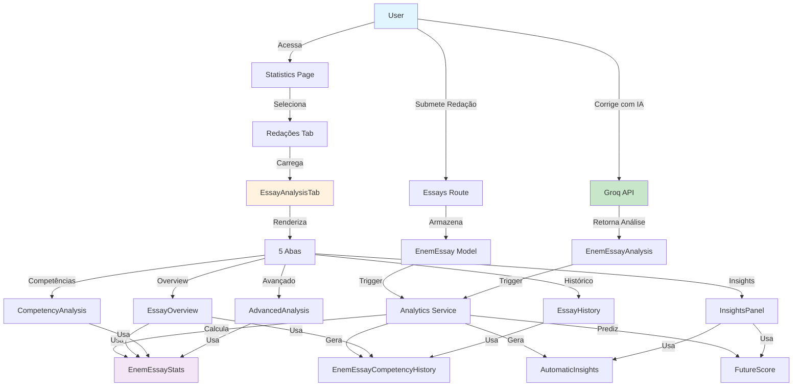

# 🎨 Diagramas Visuais - Sistema de Análise de Redações

## Fluxo Geral do Sistema



---

## Arquitetura em Camadas

```
┌─────────────────────────────────────────────────────────────┐
│                     APRESENTAÇÃO (UI)                       │
│  ┌────────────────────────────────────────────────────────┐ │
│  │  Statistics Page (React Component)                    │ │
│  │  ┌──────────────────────────────────────────────────┐ │ │
│  │  │  EssayAnalysisTab (Container)                   │ │ │
│  │  │  ┌────────────────────────────────────────────┐ │ │ │
│  │  │  │ EssayOverview    CompetencyAnalysis        │ │ │ │
│  │  │  │ InsightsPanel    EssayHistory              │ │ │ │
│  │  │  └────────────────────────────────────────────┘ │ │ │
│  │  └──────────────────────────────────────────────────┘ │ │
│  └────────────────────────────────────────────────────────┘ │
└─────────────────────────────────────────────────────────────┘
                           ↓ (Axios)
┌─────────────────────────────────────────────────────────────┐
│                     CAMADA DE API                           │
│  ┌────────────────────────────────────────────────────────┐ │
│  │  useEssayStats Hook (State Management)               │ │
│  │  essayStatsService (API Client)                       │ │
│  └────────────────────────────────────────────────────────┘ │
└─────────────────────────────────────────────────────────────┘
                           ↓ (HTTP)
┌─────────────────────────────────────────────────────────────┐
│                   CAMADA DE ROTAS (REST)                    │
│  ┌────────────────────────────────────────────────────────┐ │
│  │  /api/essay-stats/stats                              │ │
│  │  /api/essay-stats/history                            │ │
│  │  /api/essay-stats/insights                           │ │
│  │  /api/essay-stats/prediction                         │ │
│  │  /api/essay-stats/list                               │ │
│  │  /api/essay-stats/:id/analysis                       │ │
│  │  /api/essay-stats/comparative/benchmark              │ │
│  │  /api/essay-stats/regenerate-stats                   │ │
│  └────────────────────────────────────────────────────────┘ │
└─────────────────────────────────────────────────────────────┘
                           ↓
┌─────────────────────────────────────────────────────────────┐
│                  CAMADA DE NEGÓCIO (SERVICES)               │
│  ┌────────────────────────────────────────────────────────┐ │
│  │  essayAnalyticsService                                │ │
│  │  ├─ getUserEssayStats()                              │ │
│  │  ├─ generateCompetencyHistory()                      │ │
│  │  ├─ generateInsights()                               │ │
│  │  └─ predictFutureScore()                             │ │
│  └────────────────────────────────────────────────────────┘ │
└─────────────────────────────────────────────────────────────┘
                           ↓
┌─────────────────────────────────────────────────────────────┐
│                   CAMADA DE DADOS (ORM)                     │
│  ┌────────────────────────────────────────────────────────┐ │
│  │  Prisma Client                                        │ │
│  │  EnemEssay.findMany()                                │ │
│  │  EnemEssayAnalysis.findUnique()                      │ │
│  │  EnemEssayStats.upsert()                             │ │
│  │  EnemEssayCompetencyHistory.createMany()             │ │
│  └────────────────────────────────────────────────────────┘ │
└─────────────────────────────────────────────────────────────┘
                           ↓
┌─────────────────────────────────────────────────────────────┐
│                   BANCO DE DADOS (SQL)                      │
│  ┌────────────────────────────────────────────────────────┐ │
│  │  PostgreSQL                                           │ │
│  │  ├─ enem_essays                                       │ │
│  │  ├─ enem_essay_analyses                              │ │
│  │  ├─ enem_essay_stats                                 │ │
│  │  └─ enem_essay_competency_histories                 │ │
│  └────────────────────────────────────────────────────────┘ │
└─────────────────────────────────────────────────────────────┘
```

---

## Fluxo de Dados Detalhado

```
1. SUBMISSÃO DE REDAÇÃO
   ┌─────────────┐
   │ User Input  │
   └──────┬──────┘
          ↓
   ┌──────────────────────┐
   │ POST /essays/:id     │
   │ Correcting with AI   │
   └──────┬───────────────┘
          ↓
   ┌──────────────────────────────┐
   │ Groq API Correction          │
   │ Returns: C1-C5 scores + JSON │
   └──────┬───────────────────────┘
          ↓
2. ARMAZENAMENTO
   ┌──────────────────────┐
   │ INSERT EnemEssay     │
   │ + finalScore         │
   │ + competency1-5      │
   └──────┬───────────────┘
          ↓
   ┌──────────────────────┐
   │ INSERT              │
   │ EnemEssayAnalysis    │
   │ + detailed JSON      │
   └──────┬───────────────┘
          ↓
3. PROCESSAMENTO (Analytics Service)
   ┌────────────────────────────────┐
   │ getUserEssayStats(userId)      │
   │ ├─ SUM, AVG, MAX, MIN         │
   │ ├─ MEDIAN calculation         │
   │ ├─ Evolution %                │
   │ └─ Tendency detection         │
   └────────┬───────────────────────┘
            ↓
   ┌────────────────────────────────┐
   │ generateCompetencyHistory()    │
   │ GROUP BY week/month            │
   │ Create snapshots               │
   └────────┬───────────────────────┘
            ↓
   ┌────────────────────────────────┐
   │ generateInsights()             │
   │ Analyze patterns               │
   │ Generate recommendations       │
   └────────┬───────────────────────┘
            ↓
   ┌────────────────────────────────┐
   │ predictFutureScore()           │
   │ Calculate trajectory           │
   │ Probability estimation         │
   └────────┬───────────────────────┘
            ↓
4. FRONTEND DISPLAY
   ┌────────────────────────────────┐
   │ GET /api/essay-stats/stats     │
   │ Returns: Aggregated Stats      │
   └────────┬───────────────────────┘
            ↓
   ┌────────────────────────────────┐
   │ useEssayStats Hook             │
   │ State Management               │
   │ Cache & Update                 │
   └────────┬───────────────────────┘
            ↓
   ┌────────────────────────────────┐
   │ React Components               │
   │ ├─ Overview (Charts)           │
   │ ├─ Competencies (Details)      │
   │ ├─ Insights (AI)               │
   │ ├─ History (Table)             │
   │ └─ Advanced (Analysis)         │
   └────────┬───────────────────────┘
            ↓
   ┌────────────────────────────────┐
   │ Browser Rendering              │
   │ Interactive Dashboard          │
   └────────────────────────────────┘
```

---

## Estrutura de Dados - Entity Relationship

```
┌─────────────────┐
│     User        │
├─────────────────┤
│ id (PK)         │
│ name            │ 1─────────────┐
│ email           │       └────────┼──────────────────┐
│ ...             │               │                  │
└─────────────────┘               │                  │
                            1:M   │              1:M
                                  │
                ┌──────────────────▼──────────────┐
                │      EnemEssay                  │
                ├─────────────────────────────────┤
                │ id (PK)                         │
                │ userId (FK) ────────────┐       │
                │ theme                   │       │
                │ content                 │       │
                │ wordCount               │       │
                │ lineCount               │       │
                │ finalScore              │       │
                │ competency1-5 (C1-C5)   │    1:1│
                │ correctionStatus        │       │
                │ aiCorrection (JSON)     │       │
                │ submittedAt              │       │
                │ correctedAt              │       │
                └──────────────────┬──────┘       │
                                   │ 1:1         │
                        ┌──────────▼────────────┐ │
                        │ EnemEssayAnalysis    │ │
                        ├──────────────────────┤ │
                        │ id (PK)              │ │
                        │ essayId (FK,unique)  │ │
                        │ themeIdentified     │ │
                        │ c1-5Analysis (JSON) │ │
                        │ strengths[]         │ │
                        │ weaknesses[]        │ │
                        │ improvements[]      │ │
                        │ percentileRank      │ │
                        └──────────────────────┘ │
                                                 │
                ┌──────────────────────────────┐ │
                │   EnemEssayStats  1:1        │ │
                ├──────────────────────────────┤ │
                │ userId (PK/FK)   ─────────────┘
                │ totalEssays      │
                │ averageScore     │
                │ bestScore        │
                │ avgC1-5          │
                │ evolutionPct     │
                │ tendency         │
                │ frequency        │
                │ consistency      │
                │ weakest/strongest│
                │ updatedAt        │
                └──────────────────┘

                ┌──────────────────────────────────┐
                │ EnemEssayCompetencyHistory  1:M  │
                ├──────────────────────────────────┤
                │ id (PK)                          │
                │ userId (FK) ──────────────────────┐
                │ period (weekly/monthly)          │
                │ startDate                        │
                │ avgC1-5 per period              │
                │ trendC1-5                       │
                │ essayCount                      │
                │ createdAt                       │
                │ unique: (userId, period, start) │
                └──────────────────────────────────┘
```

---

## Ciclo de Vida de uma Redação

```
     NOVO
      │
      ▼
 ┌─────────────────┐
 │ CREATE (Escrita)│◄─────────── User escreve e submete
 └────────┬────────┘
          │
          ▼
 ┌──────────────────────┐
 │ SUBMITTED (Aguard)   │◄─────── Redação armazenada
 │ status='pending'     │         em EnemEssay
 └────────┬─────────────┘
          │
          ▼
 ┌──────────────────────────┐
 │ CORRECTING (IA Processing)│◄── Groq API corrigindo
 └────────┬─────────────────┘
          │
          ▼
 ┌──────────────────────────┐
 │ ANALYSIS (IA Complete)   │◄── EnemEssayAnalysis criada
 │ Analysis JSON generated  │    Scores C1-C5 definidos
 └────────┬─────────────────┘
          │
          ▼
 ┌────────────────────────────────────┐
 │ STATS UPDATE (Analytics Service)   │◄── Atualiza stats
 │ calculateStats()                   │    Atualiza histórico
 │ generateHistory()                  │    Gera insights
 │ generateInsights()                 │    Prediz futuro
 │ predictFutureScore()               │
 └────────┬───────────────────────────┘
          │
          ▼
 ┌────────────────────────────────┐
 │ CORRECTED (Complete)           │◄── Status final
 │ status='corrected'             │    Pronto para análise
 │ Data fully available           │
 └────────┬───────────────────────┘
          │
          ▼
 ┌────────────────────────────────┐
 │ DISPLAY (Dashboard)            │◄── Visualizado no
 │ Rendered in UI                 │    Dashboard de Redações
 │ Charts generated               │
 │ Insights displayed             │
 └────────────────────────────────┘
```

---

## Fluxo de Componentes React

```
EssayAnalysisTab (Container/Orchestrador)
│
├─► Tabs (shadcn/ui)
│   ├─ TabsList (Navigation)
│   │  ├─ "overview" trigger
│   │  ├─ "competencies" trigger
│   │  ├─ "insights" trigger
│   │  ├─ "history" trigger
│   │  └─ "advanced" trigger
│   │
│   └─ TabsContent (5 sections)
│      │
│      ├─► TabsContent value="overview"
│      │   └─ EssayOverview
│      │      ├─ CardComponent (4x)
│      │      │  ├─ BarChart2, TrendingUp, Activity, Target
│      │      │  └─ Value + trend
│      │      │
│      │      ├─ RadarChart (Recharts)
│      │      │  └─ 5 datasets (C1-C5)
│      │      │
│      │      ├─ BarChart (Recharts)
│      │      │  └─ Você vs Nacional (2 series)
│      │      │
│      │      └─ LineChart (Recharts)
│      │         └─ Evolução temporal
│      │
│      ├─► TabsContent value="competencies"
│      │   └─ CompetencyAnalysis
│      │      └─ Tabs (shadcn/ui)
│      │         └─ 5 TabsContent (C1-C5)
│      │            └─ For each:
│      │               ├─ Score Display
│      │               ├─ Progress Bar
│      │               ├─ Level Badge
│      │               ├─ Aspects List
│      │               └─ Suggestions
│      │
│      ├─► TabsContent value="insights"
│      │   └─ InsightsPanel
│      │      ├─ Prediction Section
│      │      │  ├─ Score Card
│      │      │  ├─ Confidence
│      │      │  └─ Probability Badges
│      │      │
│      │      └─ Insights Section
│      │         └─ Alert (shadcn/ui)
│      │            ├─ Título + tipo
│      │            ├─ Descrição
│      │            └─ Conselho
│      │
│      ├─► TabsContent value="history"
│      │   └─ EssayHistory
│      │      ├─ Benchmark Section
│      │      │  ├─ BarChart (Você vs Nat vs Top)
│      │      │  └─ Stats Cards (3x)
│      │      │
│      │      ├─ Table Section
│      │      │  ├─ TableHeader (Col names)
│      │      │  └─ TableBody (Essays rows)
│      │      │     ├─ Date
│      │      │     ├─ Theme
│      │      │     ├─ Score Badge
│      │      │     └─ Status
│      │      │
│      │      └─ Trend Section
│      │         ├─ Direction (arrow)
│      │         ├─ Frequency
│      │         └─ Consistency
│      │
│      └─► TabsContent value="advanced"
│          └─ AdvancedAnalysis
│             ├─ Writer Profile
│             ├─ Habits & Productivity
│             ├─ Semantic Analysis
│             └─ Correlations

useEssayStats Hook (State & Logic)
├─ State
│  ├─ stats: EnemEssayStats
│  ├─ history: CompetencyHistoryPoint[]
│  ├─ insights: AutomaticInsight[]
│  ├─ prediction: PredictionData
│  ├─ essays: EnemEssay[]
│  ├─ loading: boolean
│  └─ error: string?
│
└─ Methods
   ├─ refreshStats()
   ├─ loadEssayAnalysis()
   ├─ filterEssays()
   └─ getBenchmark()

essayStatsService (API Bridge)
├─ getStats()
├─ getHistory()
├─ getInsights()
├─ getPrediction()
├─ listEssays()
├─ getEssayAnalysis()
├─ getBenchmarkComparison()
└─ regenerateStats()
```

---

## Estado Global do Usuário

```
┌────────────────────────────────────────────┐
│  useEssayStats Hook - Estado Completo     │
├────────────────────────────────────────────┤
│                                            │
│ stats: EnemEssayStats {                    │
│   userId, totalEssays, averageScore,      │
│   bestScore, avgC1-5, evolutionPct,       │
│   tendency, frequency, consistency,       │
│   weakest, strongest, updatedAt           │
│ }                                          │
│                                            │
│ history: CompetencyHistoryPoint[] {        │
│   [{period, startDate, avg*, trend*}]     │
│ }                                          │
│                                            │
│ insights: AutomaticInsight[] {             │
│   [{type, priority, description,          │
│     advice, relatedCompetency}]           │
│ }                                          │
│                                            │
│ prediction: PredictionData {               │
│   projectedScore, timeframe, confidence,  │
│   probability900, probability950,         │
│   probabilityPerfect                      │
│ }                                          │
│                                            │
│ essays: EnemEssay[] {                      │
│   [{id, theme, finalScore, status,        │
│     competency1-5, submittedAt}]          │
│ }                                          │
│                                            │
│ benchmark: BenchmarkComparison {           │
│   userAvg, nationalAvg, userPercentile,   │
│   distanceToNational, topPerformerAvg     │
│ }                                          │
│                                            │
│ loading: boolean (true during fetch)       │
│                                            │
│ error: string? (if request failed)         │
│                                            │
└────────────────────────────────────────────┘
```

---

**Diagramas criados em Mermaid e ASCII para referência visual** 📊
